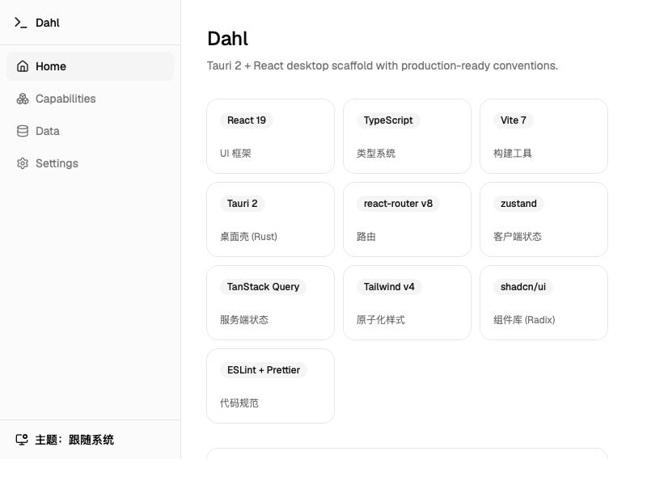

# Dahl

> 得名于 **Ole-Johan Dahl**（1931–2002）——Simula 语言共同发明者、面向对象编程奠基人：
> 他为现代编程打下地基，Dahl 为你的桌面应用打下地基。

[](./LICENSE)


[](https://github.com/mbr1024/dahl/actions/workflows/build.yml)

**English version: [README.en.md](README.en.md).**

Tauri 2 + React 19 桌面应用脚手架，集成了 2026 年主流的工程化实践，开箱即用。

> 状态：`0.1.0` 首发。发布与更新流程见 [docs/DEPLOYMENT.md](docs/DEPLOYMENT.md)，变更记录见 [CHANGELOG.md](CHANGELOG.md)。

## 截图



## 技术栈

| 层     | 选型                                        |
| ------ | ------------------------------------------- |
| UI     | React 19 + TypeScript + Vite                |
| 桌面壳 | Tauri 2（Rust）                             |
| 路由   | react-router v8                             |
| 状态   | zustand（客户端）+ TanStack Query（服务端） |
| 样式   | Tailwind CSS v4 + shadcn/ui（Radix）        |
| 规范   | ESLint 10（flat config）+ Prettier          |

## 快速开始

```bash
# 方式一：直接用模板创建新项目（无需 fork）
pnpm dlx degit mbr1024/dahl my-app && cd my-app && pnpm install
pnpm run tauri dev        # 开发（首次编译 Rust 较慢）

# 方式二：在本仓库内开发
pnpm install
pnpm run tauri dev        # 开发（首次编译 Rust 较慢）
pnpm run tauri build      # 打包安装包
```

## 常用命令

```bash
pnpm run dev              # 仅前端 dev server
pnpm run build            # 前端构建
pnpm run typecheck        # TypeScript 类型检查
pnpm run lint             # ESLint
pnpm run lint:fix         # ESLint 自动修复
pnpm run format           # Prettier 格式化
pnpm run test             # Vitest 单元测试
pnpm run test:e2e         # WebdriverIO 端到端测试（自动构建 debug 版后运行）
pnpm run changeset        # 记录版本变更（自动生成版本 PR）
pnpm run tauri build      # 打包安装包（macOS: .app/.dmg）
```

## 端到端测试

基于 WebdriverIO + `@wdio/tauri-service`（embedded WebDriver，WebDriver server 内嵌于应用，
无需安装外部 driver），覆盖：应用启动、Rust 命令 invoke、路由导航、i18n 切换。

```bash
pnpm run test:e2e         # 构建 debug 二进制后运行
pnpm run test:e2e:run     # 已构建过时直接运行（CI 用）
```

注意事项：

- **先关闭正在运行的 Dahl 实例**（single-instance 插件会让新实例让位给旧进程）
- 测试插件（`tauri-plugin-wdio`）仅在 dev/debug 构建注册，release 产物不含测试后门
- Linux 无显示环境需 `xvfb-run`；macOS/Windows 开箱即用
- 测试代码在 `e2e/`，配置见 `wdio.conf.ts`，类型检查见 `tsconfig.e2e.json`

## 目录结构

```
src/
├── routes/          # 页面级组件（一个路由一个文件）
├── components/
│   ├── ui/          # shadcn 生成的组件（勿手改）
│   ├── layout/      # 布局外壳、主题/语言 Provider
│   └── error-boundary.tsx  # 全局错误边界
├── stores/          # zustand 全局状态（主题/语言，persist）
├── services/        # 数据请求层（TanStack Query + http 插件）
├── i18n/            # react-i18next（zh/en，默认中文）
├── hooks/           # 通用 hooks
├── lib/             # 工具函数（cn 等）
└── test/            # 测试 setup
src-tauri/
├── src/lib.rs       # Rust 入口：插件注册、命令、托盘
├── capabilities/    # 权限配置（zero-trust，按需放开）
└── tauri.conf.json  # 窗口、打包、updater、deep-link 配置
e2e/                 # WebdriverIO 端到端测试（embedded WebDriver）
docs/                # 部署与运维文档（updater 配置等）
.github/workflows/   # CI：检查 / e2e / Linux 构建（tag 发布时三平台）
```

## 已集成插件

`fs`、`dialog`、`store`、`window-state`、`clipboard-manager`、
`notification`、`single-instance`、`http`、`updater`、`log`、`autostart`、
`sql`（SQLite）、`shell`、`deep-link`、`opener`

示例页（侧边栏 → 桌面能力）演示：Rust 命令 invoke、文件对话框、剪贴板、
系统通知、键值存储、SQLite 增删查、Shell 执行、深链接监听。

## 贡献

欢迎提交 Issue 与 PR！请先阅读 [CONTRIBUTING.md](.github/CONTRIBUTING.md)（开发环境、提交规范、PR 流程），
安全漏洞报告见 [SECURITY.md](.github/SECURITY.md)，本项目遵循 [贡献者公约](.github/CODE_OF_CONDUCT.md)。

## 脚手架约定

- **权限**：Tauri 2 默认全拒绝。`clipboard-manager` / `sql` /
  `shell` / `deep-link` 的 `default` 权限集为空，使用对应 API 时需在
  `capabilities/` 显式加 `allow-*` 权限（排查：看 `src-tauri/gen/schemas/acl-manifests.json`）
- **托盘**：左键单击切换主窗口显隐，右键菜单可退出；关闭窗口会隐藏到托盘
- **updater**：以 GitHub Releases 作为更新源（endpoint 指向 `latest.json`），正式签名密钥已配置；
  发布时 CI 自动签名并生成更新清单，完整流程见 [docs/DEPLOYMENT.md](docs/DEPLOYMENT.md)
- **deep-link**：scheme 为 `dahl://`，dev 模式测试需先在系统注册 scheme
- **主题/语言**：`src/stores/use-settings.ts` 控制，偏好持久化；默认中文（i18n 提供中英切换）
- **提交**：husky + lint-staged 在 pre-commit 自动执行 lint/format

## 推荐 IDE

- [VS Code](https://code.visualstudio.com/) + [Tauri](https://marketplace.visualstudio.com/items?itemName=tauri-apps.tauri-vscode) + [rust-analyzer](https://marketplace.visualstudio.com/items?itemName=rust-lang.rust-analyzer)
